# 5 Card Memory Training Game

This is a web based memory training game that allows users to improve their short-term memory through visual pattern recognition. As short-term memory capacity has been linked to greater overall brain function, improved strategic and critical thinking and positive gains in mental sharpness and health, this simple game which can be played anywhere an internet connection is available provides great benefits to the user.

## UX

The following User Stories were used to focus the development of the project. Note that the feautures mentioned below are described in detail with screenshots in the features section of this README.

### User (Game Player)

1. As a user, I want to play a pattern recognition game which is both enjoyable and has simple-to-follow rules but which provides positive benefits to my memory capacity and brain function.
2. As a user, I want the on-screen layout of the game and its interactivity to be easy and intuitive to use.
3. As a user, I want to be able to play the game on devices of all screen sizes.
4. As a user, I want to be able to select objects (cards) easily and intuitively.
5. As a user, I want the game to increase in difficulty as my skills and capacity improve.
6. As a user, I want to know what level of the game I am currently playing at and how many rounds I have until game completion.
7. As a user, I want to see clearly what my current selection of cards is.
8. As a user, I want to be able to remove the last object (card) I have selected in my selection.
9. As a user, I want to be able to clear my current selection so that I can start over with my selection.
10. As a user, I want to be easily able to submit my selection. 
11. As a user, I want to receive feedback on my selection submission as to whether it is correct or incorrect.
12. As a user, I want the game to flow seamlessly from one round to the next.

The project provides solutions to the above User Stories as follows;

1. The game is relatively simple to play - five playing cards are displayed for a set period of time before disappearing from view, with the pattern to be recalled and replicated by the user. On loading the player interface area for the 1st time there is an explanation of how to play.
2. The layout and gameplay across all screen sizes has been developed with positive User Experience as a priority.
3. The on-screen layout adapts to all screen sizes to maximise player usability.
4. Cards are selected by the user by simply clicking on the card image from the 52 card images available.
5. As more consequtive correct patterns are identified by the player, the time period for which the randomly generated cards are displayed shortens, thus increasing the difficulty of the game.
6. A description of the level of the game at which the player is currently at is displayed in the user/player interface area along with the number of rounds required until game completion.
7. The users selection of cards are shown in the user interface area.
8. The user can remove the last card inputted into his or her selection by simply clicking the "REMOVE" button.
9. The user can clear all the cards from their current selection by clicking the "CLEAR ALL" button.
10. The user can submit his or her selection simply by clicking on the "SUBMIT" button.
11. The user, after clicking the "SUBMIT" button gets instant feedback on whether the correct or incorrect selection was made.
12. After clicking the "SUBMIT" button and providing feedback as to whether the user's selection was correct or incorrect, the game flows into another round without any input requried from the user.

### Wireframes

A series of wireframes were produced prior to coding to assist with the project development. These can be found in the project repository (MILESTONE-PROJECT-1/wireframes.pdf) or can be accessed online from https://github.com/darraghogorman37/Milestone-Project-1/blob/cd84c7c647a8ff781902cb82f42f6fa4a5d28c6a/wireframes.pdf.

## Features

The below sections detail both the existing features and potential future fetaures yet to be developed.

### Existing Features

* Player-Interface Area
    * Surrounded by a grey border, this area "sticks" to the top of the screen meaning that players always have accessibility to it, even on smaller screens where they may have to scroll down the screen to select cards to fill their selection. The player interface area contains 5 placeholders where the player's selected cards are displayed. The player interface area also contains the player's buttons and the feedback area. 
    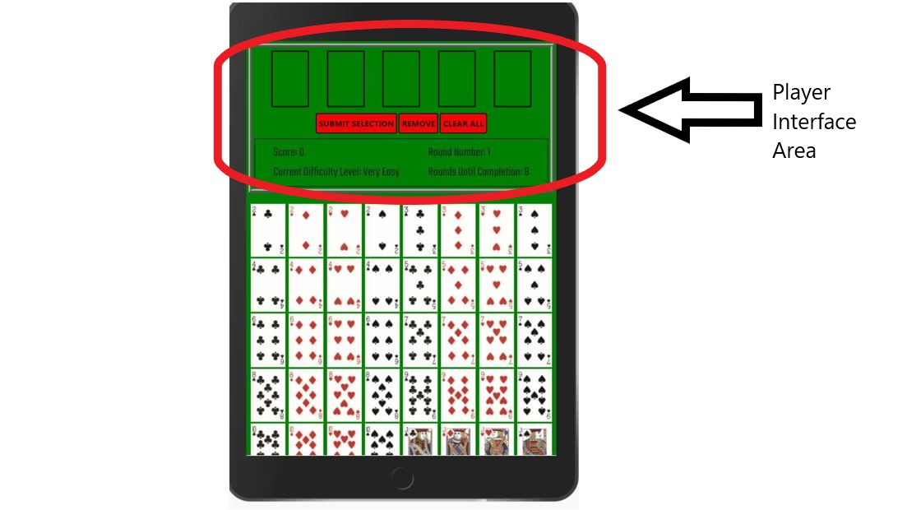
* Player's Card Selection Placeholders
    * These are containers which display the players selected cards. 
    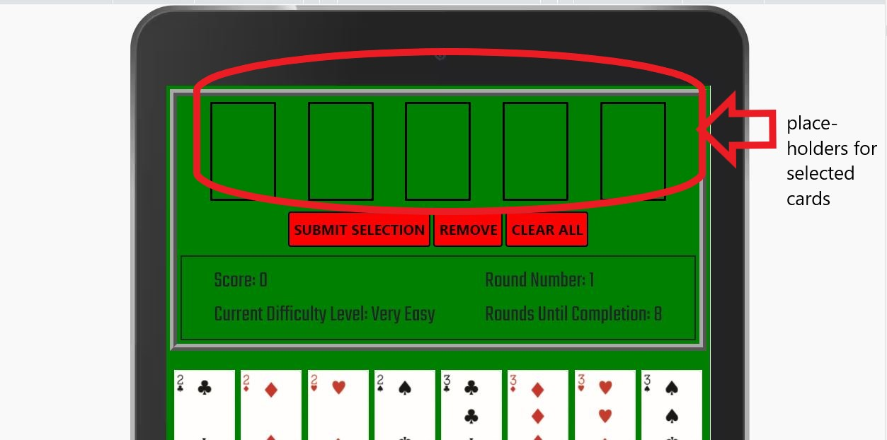
* "SUBMIT SELECTION", "REMOVE" and "CLEAR ALL" player buttons
    * These are the player's buttons. The user can remove the last card inputted into his or her selection by simply clicking the "REMOVE" button. The user can clear all the cards from their current selection by clicking the "CLEAR ALL" button. The user can submit his or her selection simply by clicking on the "SUBMIT" button.
    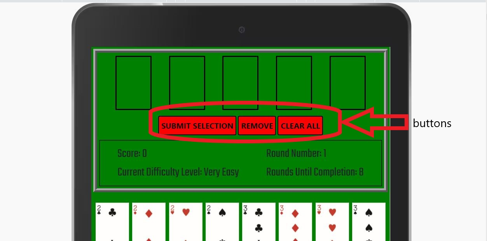
* Feedback Area
    * Displays messages to the player as the game progresses. On submission of his/her selected cards the feedback area informs the player if their selection was correct or incorrect. The  and displays the player's score and the difficully level currently being played at, the number of rounds completed thus far and the number of rounds until completion of the game.  
    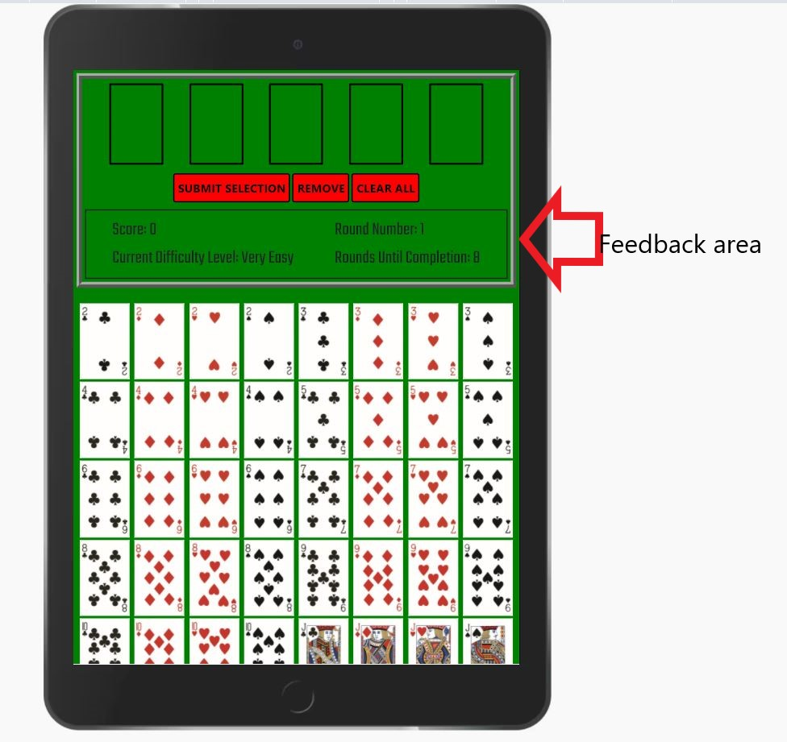

    On loading the player interface area for the 1st time there is an explanation of how to play within the feedback area to get the player started.
    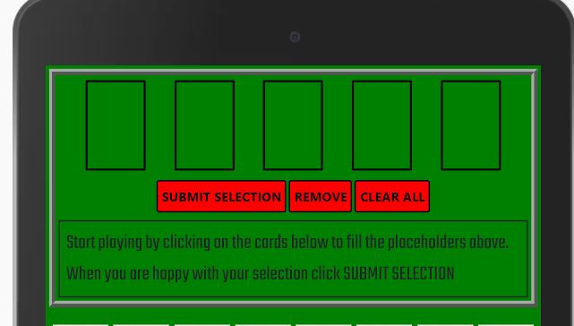

    Messages are displayed to the player indicating whether the card pattern he/she submitted was correct or incorrect.   
    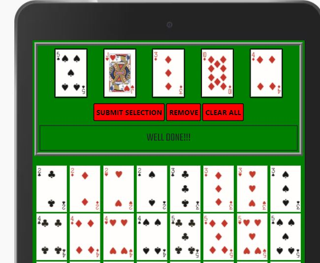  

    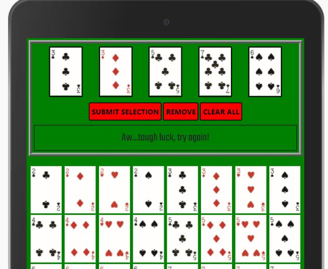

    If the player attempts to select a 6th card when the place holders are already full with 5 cards he/she will be alerted with the following message.
    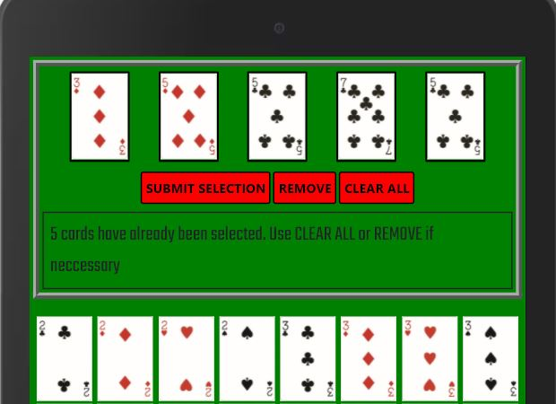

    If the player presses the "SUBMIT SELECTION" button when there is not yet 5 cards selected he/she will be alerted with the following message.
    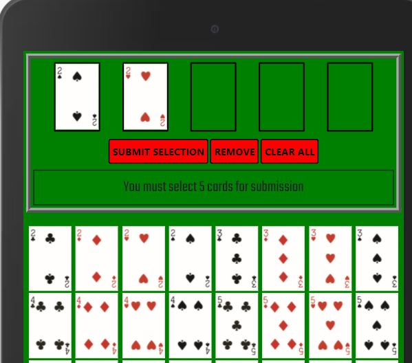

    On completion of the game a message is displayed congratulating the player.  
    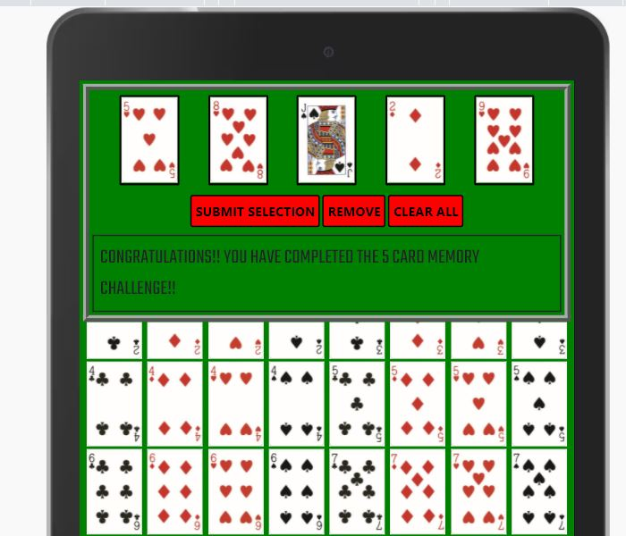

* Intuitive Object Selection
    * The player can fill his / her selection placeholders with the required cards by simply clicking on any of the 52 card images below the player interface area.  
    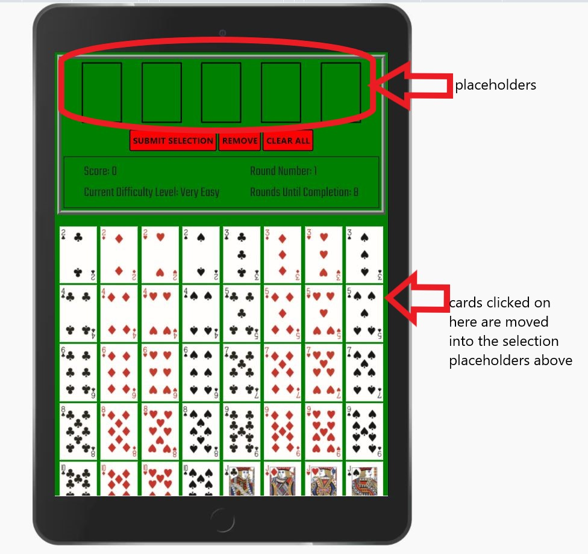
* Cross-device compatability
    * The appearance and layout of the screens within the game adapt to different screen sizes in order to ensure excellent User Experience and allow the game to be played on all types of devices. The layouts on an iPhone 5/SE, iPad and laptop are shown respectively below.  
    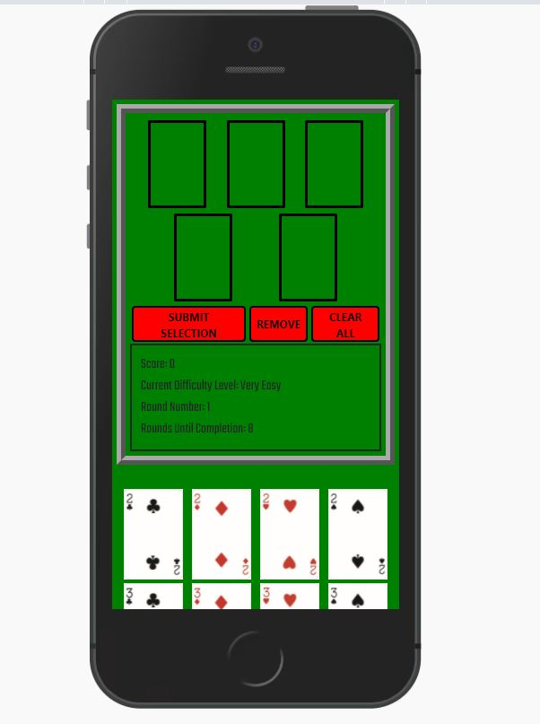  
    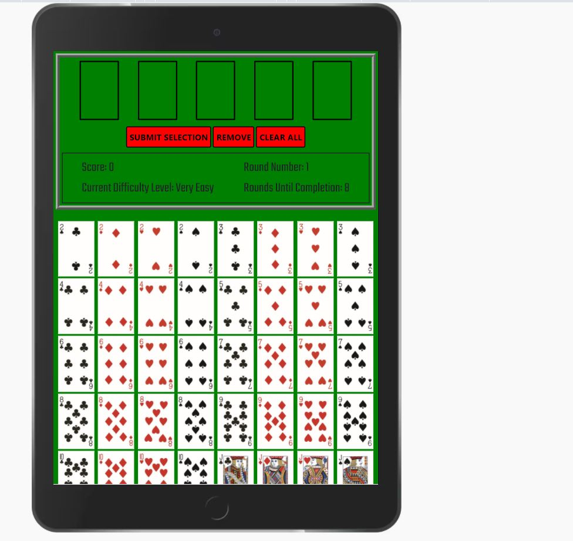  
      

* Increasing difficulty through game progression.
    * As more consequtive correct patterns are identified by the player, the time period for which the randomly generated cards are displayed shortens, thus increasing the difficulty of the game.

### Features Left to Implement

* Allow users to fill the placeholders by dragging and dropping the cards into the placeholders.
* Allow users to increase the game difficulty themselves by giving the option of increasing the number of cards they must recall.

## Technologies Used

The below resources were used to produce this project:

* HTML5
    * For writing web content.
    * https://html.spec.whatwg.org/

* CSS3
    * For styling HTML content.
    * https://www.w3.org/Style/CSS/

* Javascript
    * For interactive gameplay
    * https://www.javascript.com/

* Bootstrap's HTML, CSS and Java frameworks and libraries
    *  Bootstrap "grid system" for the layout of the 5 randomly generated cards.
    *  https://getbootstrap.com/

* jsDelivr
    * CDN for accessing Bootstrap
    * https://www.jsdelivr.com/

* JQuery
    * Javascript library and framework used for object selection and event listeners. 
    * https://jquery.com/

* ABCL Resource Center
    * For card images.
    * https://acbl.mybigcommerce.com/

* Google Fonts
    * For "Teko" font type used in the feedback area.
    * https://fonts.google.com/

* Gitpod
    * Integrated Development Environment (IDE).
    * https://www.gitpod.io/

* Github
    * For code hosting / storage.
    * https://github.com/

* Gitpages
    * For deployment of code to the internet.
    * https://pages.github.com/

* Google Chrome Web Browser
    * For testing the layout of the webpage on this browser.
    * https://www.google.com/intl/en_ie/chrome/

* Google Chrome Developer Tools
    * For examing webpage layout on various devices with different screen sizes.
    * For experimenting with changes to the code and their imapct in the browser.
    * https://developer.chrome.com/docs/devtools/

* Internet Explorer
    * For testing the layout of the webpage on this browser.
    * https://www.microsoft.com/en-ie/download/internet-explorer.aspx

* Mozilla Firefox
    * For testing the layout of the webpage on this browser.
    * https://www.mozilla.org/en-US/firefox/new/

* W3C CSS Validator
    * For validating CSS code.
    * https://jigsaw.w3.org/css-validator/

* W3C Markup Validator
    * For validating HTML code.
    * https://validator.w3.org/

* JSHint
    * For validating Javascript code.
    * https://jshint.com/

* Emmet
    * Web Development Toolkit
    * https://emmet.io/

## Development Cycle and Commit Messages

XXXXXXXX

## Code Validation

All html code was run through the W3C Markup Validator (https://validator.w3.org/), all CSS code was run through the W3C CSS Validator (https://jigsaw.w3.org/css-validator/) and all Javascript code was run through the JSHint validator (https://jshint.com/). XXXXXThe CSS code was returned with no errors or warnings. There were a number of warnings associated with the HTML code where heading elements were not placed before section elements. Upon review it was not deemed appropriate to include these. There were no errors associated with the HTML code.XXXXXX

## Testing

### Test Deployment

1. Visit the relevant webpage address (https://darraghogorman37.github.io/) and ensure site is live.
2. Visit the above address via Google Chrome, Internet Explorer and Mozilla Firefox browsers.
3. Compare the "deployed" version of the website with the version outputted from the source code in the project repository.

### Application Testing

1. Open the web page / run files to start game and check 5 cards are displayed for a period of time before the player interface screen loads.

2. Check that clicking on cards below the player interface area sequentially fills the blank "holder" spaces in the player interface area.

3. Check that clicking the "REMOVE" button removes the most recently selected card from its holder.

4. Check that clicking the "CLEAR ALL" button removes all the currently selected cards from their holders

5. Check that clicking the "SUBMIT SELECTION" button when there are less than 5 cards selected in the placeholders produces the message "You must select 5 cards for submission" in the feedback area. Also check that the message "5 cards have already been selected" is displayed in the feedback area when there are 5 cards in the placeholder and the player attempts to add another card.   

6. After random repition and multiple iterations of steps 2-5 above, select 5 cards to place in the holders so that these cards selected (and the order in which they are selected) match the randomly generated cards (and the order in which they were displayed) from Step 1 above. This can be ensured by reading the log of the 5 randomly generated cards from the console.
 
7. Check that clicking the "SUMBIT SELECTION" button produces a statement in the feedback area telling the player if the answer is correct ("WELL DONE!!!" is displayed in the feedback area) or incorrect ("Aw...tough luck, try again!") and subsequently displays 5 randomly generated new cards (next round of the game).

8. Repeat steps 1-7 above for subsequent rounds of the game, progressing through the game with correct answers.

9. Check the time periods for displaying the randomly generated cards reduces according to the following schedule. The time period for a particular display is logged out in the console. 

10. Along with the time periods described above, check that the difficulty level increases in line with the schedule below as the game progresses.

11. On completeion of 8 rounds of the game, check that the following message "CONGRATULATIONS!! YOU HAVE COMPLETED THE 5 CARD MEMORY CHALLENGE!!" is displayed in the feedback area and the game returns to the beginning. 

12. Repeat steps 1-11 above for 2 full rounds of the new game following completion of the previous game.

13. Submit an incorrect pattern by selecting 5 cards into the placeholders that are not the same as those that were randomly generated and clicking the "SUBMIT SELECTION" button. Check that this results in the display of a message indicating that the incorrect pattern has been submitted ("Aw...tough luck, try again!" should be displayed in the feedback area).

14. Complete the above steps 1-13 for both the development version of the game and the deployed version of the game. Ensure there are no differences in the layout and functionality of the two versions.

## Deployment

Deployment of the project was achieved through the use of GitHub Pages.

The project files were copied into a GitHub online repository which automatically deploys to the web address https://darraghogorman37.github.io/

The project was deployed to GitHub Pages using the following steps...

1. Log in to GitHub and locate the GitHub Repository
2. At the top of the Repository (not top of page), locate the "Settings" Button on the menu.
3. Alternatively Click Here for a GIF demonstrating the process starting from Step 2.
4. Scroll down the Settings page until you locate the "GitHub Pages" Section.
5. Under "Source", click the dropdown called "None" and select "Master Branch".
6. The page will automatically refresh.
7. Scroll back down through the page to locate the now published site link in the "GitHub Pages" section.

## Credits

### Content

The "Teko" font-type used for text in the player feedback area is from the Google Fonts library. https://fonts.google.com/

### Media

The card images were obtained online from the American Bridge Contract League (ABCL) Resource Center. See https://acbl.mybigcommerce.com/.

### Acknowledgements

- This project is dedicated to my fiancée.
